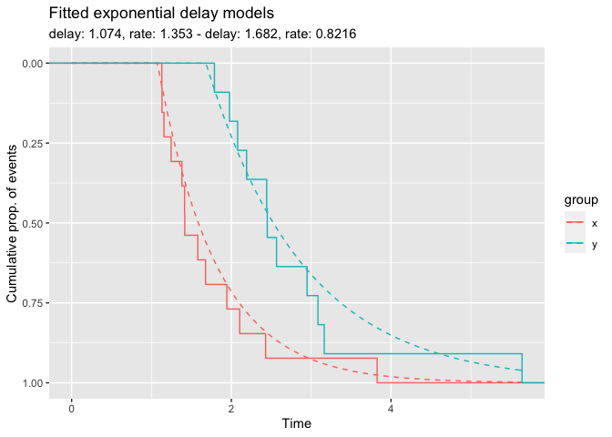
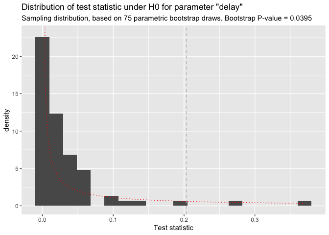

<!-- README.md is generated from README.Rmd. Please edit that file -->

# incubate

<!-- badges: start -->
<!-- badges: end -->

Parametric time-to-event analysis where groups show an incubation period
with different hazard.

## Example

With incubate, you can statistically compare the survival experience of
two groups with respect to delay and other parameters.

``` r
library(incubate)

# simulate data from exponential distribution with delay
x <- rexp_delayed(n = 13, delay = 1.1)
y <- rexp_delayed(n = 11, delay = 1.6)

# fit delay model 
fm <- delay_model(x, y)

plot(fm)
```



``` r
delay_test <- test_delay_diff(x, y, R = 100)
plot(delay_test)
```



## Installation

The `incubate` package is hosted publicly at
[Gitlab](https://gitlab.com/imb-dev/incubate). To install its latest
version use from within an R-session:

``` r
remotes::install_gitlab("imb-dev/incubate")
```

To install a specific version, add the version tag after the name,
separated by a `@`, e.g. to install `incubate` in version `v0.0.2` use

``` r
remotes::install_gitlab("imb-dev/incubate@v0.0.2")
```
