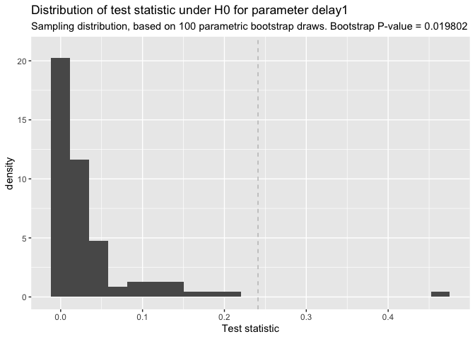

<!-- README.md is generated from README.Rmd. Please edit that file -->

# incubate

<!-- badges: start -->
<!-- badges: end -->

In survival analysis, one sometimes encounters situations where events
only start to occur after a certain delay since entry time and this
delay varies for different treatments or groups. While parametric delay
models, like the three-parameter Weibull distribution, might adequately
describe this process the estimation of delay via standard maximum
likelihood is severely biased in small samples. The R-package `incubate`
employs an alternative estimation method called *maximum spacing
estimation (MSE)* to estimate delay and other parameters in a one or two
group setting. Building on MSE, `incubate` can

1.  calculate confidence intervals for these model parameters *and*
2.  compare the survival experience of two groups within this
    statistical model with respect to model parameters.

## Example

The `incubate`-package provides the delayed exponential distribution as
special case of the delayed Weibull distribution. We draw random samples
corresponding to two groups with different model parameters.

``` r
library(incubate)

# simulate data from exponential distribution with delay
x <- rexp_delayed(n = 13, delay = 1.0, rate = 0.8)
y <- rexp_delayed(n = 11, delay = 1.5, rate = 1.2)
```

We use the model function `delay_model` to fit a exponential model with
delay to both groups and show the model fit.

``` r
fm <- delay_model(x, y)

plot(fm)
```


Inference on the model parameters is possible through `confint` for
bootstrap confidence intervals and `delay_test` for parameter
comparisons in a two group setting.

``` r
# confidence interval for delay-parameters
confint(fm, parm = c('delay.x', 'delay.y'))
#>            2.5%  97.5%
#> delay.x 0.85443 1.2627
#> delay.y 1.37808 1.9318

# test on difference in delay
# for real applications use R>=1000 bootrap draws
delay_test <- test_diff(x, y, R = 100)
plot(delay_test)
```



## Parallel computation

To switch on parallel computation, e.g. for bootstrap parameter tests or
power simulations, simply set up a suitable computation plan via the
Future-API. For instance, do the following to activate four R-sessions
in the background of your local computer for computer-intensive tasks in
`incubate`:

``` r
library("future")
plan(multisession, workers = 4)
```

That’s it. You do *not* have to change any function calls. `incubate` is
`future`-aware. Consult the [`future`-package on
CRAN](https://CRAN.R-project.org/package=future) for more information
about futures and about supported computation plans.

When you are done with the heavy computing, it is best practice to
release the parallel connections via `plan(sequential)`.

## Installation

The `incubate` package is found on
[CRAN](https://cran.r-project.org/package=incubate) and development
happens at [Gitlab](https://gitlab.com/imb-dev/incubate).

Use `install.packages` to install `incubate` from CRAN as usual, i.e.,
`install.packages('incubate')` should do.

To install its **latest version** from the main branch on Gitlab use the
following R-code:

``` r
remotes::install_gitlab("imb-dev/incubate")
```

To install a specific version, add the version tag after the name,
separated by a `@`, e.g. to install `incubate` in version `v1.0` use

``` r
remotes::install_gitlab("imb-dev/incubate@v1.0")
```

The suffix `@develop` points to the latest **development version** from
Gitlab.
