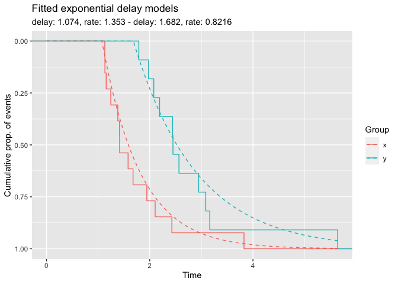

<!-- README.md is generated from README.Rmd. Please edit that file -->

# incubate

<!-- badges: start -->
<!-- badges: end -->

Parametric time-to-event analysis where groups show an incubation period
with different hazard.

## Example

With `incubate`, you can statistically compare the survival experience
of two groups with respect to delay and other parameters.

``` r
library(incubate)

# simulate data from exponential distribution with delay
x <- rexp_delayed(n = 13, delay = 1.1)
y <- rexp_delayed(n = 11, delay = 1.6)

# fit delay model 
fm <- delay_model(x, y)
#> optim_args:
#> $par
#> [1] 0.97531 1.33260 1.60647 0.86886
#> 
#> $method
#> [1] "L-BFGS-B"
#> 
#> $control
#> $control$parscale
#> [1] 0.97531 1.33260 1.60647 0.86886
#> 
#> 
#> $lower
#> delay.x  rate.x delay.y  rate.y 
#>   0e+00   1e-09   0e+00   1e-09 
#> 
#> $upper
#> delay.x  rate.x delay.y  rate.y 
#>  1.1290     Inf  1.7881     Inf

plot(fm)
```



``` r
# test on difference in delay, using only R=50 bootstrap draws
delay_test <- test_delay_diff(x, y, R = 50)
#> optim_args:
#> $par
#> [1] 0.97531 1.33260 0.86886
#> 
#> $method
#> [1] "L-BFGS-B"
#> 
#> $control
#> $control$parscale
#> [1] 0.97531 1.33260 0.86886
#> 
#> 
#> $lower
#>  delay rate.x rate.y 
#>  0e+00  1e-09  1e-09 
#> 
#> $upper
#>  delay rate.x rate.y 
#>  1.129    Inf    Inf 
#> 
#> optim_args:
#> $par
#> [1] 0.97531 1.33260 1.60647 0.86886
#> 
#> $method
#> [1] "L-BFGS-B"
#> 
#> $control
#> $control$parscale
#> [1] 0.97531 1.33260 1.60647 0.86886
#> 
#> 
#> $lower
#> delay.x  rate.x delay.y  rate.y 
#>   0e+00   1e-09   0e+00   1e-09 
#> 
#> $upper
#> delay.x  rate.x delay.y  rate.y 
#>  1.1290     Inf  1.7881     Inf 
#> 
#> optim_args:
#> $par
#> [1] 0.96487 1.25301 0.62655
#> 
#> $method
#> [1] "L-BFGS-B"
#> 
#> $control
#> $control$parscale
#> [1] 0.96487 1.25301 0.62655
#> 
#> 
#> $lower
#>  delay rate.x rate.y 
#>  0e+00  1e-09  1e-09 
#> 
#> $upper
#>  delay rate.x rate.y 
#> 1.1186    Inf    Inf 
#> 
#> optim_args:
#> $par
#> [1] 0.96487 1.25301 1.02157 0.62655
#> 
#> $method
#> [1] "L-BFGS-B"
#> 
#> $control
#> $control$parscale
#> [1] 0.96487 1.25301 1.02157 0.62655
#> 
#> 
#> $lower
#> delay.x  rate.x delay.y  rate.y 
#>   0e+00   1e-09   0e+00   1e-09 
#> 
#> $upper
#> delay.x  rate.x delay.y  rate.y 
#>  1.1186     Inf  1.2033     Inf 
#> 
#> optim_args:
#> $par
#> [1] 0.97536 1.08892 0.50818
#> 
#> $method
#> [1] "L-BFGS-B"
#> 
#> $control
#> $control$parscale
#> [1] 0.97536 1.08892 0.50818
#> 
#> 
#> $lower
#>  delay rate.x rate.y 
#>  0e+00  1e-09  1e-09 
#> 
#> $upper
#>  delay rate.x rate.y 
#> 1.1291    Inf    Inf 
#> 
#> optim_args:
#> $par
#> [1] 0.97536 1.08892 1.04259 0.50818
#> 
#> $method
#> [1] "L-BFGS-B"
#> 
#> $control
#> $control$parscale
#> [1] 0.97536 1.08892 1.04259 0.50818
#> 
#> 
#> $lower
#> delay.x  rate.x delay.y  rate.y 
#>   0e+00   1e-09   0e+00   1e-09 
#> 
#> $upper
#> delay.x  rate.x delay.y  rate.y 
#>  1.1291     Inf  1.2243     Inf 
#> 
#> optim_args:
#> $par
#> [1] 0.95963 1.16992 0.53196
#> 
#> $method
#> [1] "L-BFGS-B"
#> 
#> $control
#> $control$parscale
#> [1] 0.95963 1.16992 0.53196
#> 
#> 
#> $lower
#>  delay rate.x rate.y 
#>  0e+00  1e-09  1e-09 
#> 
#> $upper
#>  delay rate.x rate.y 
#> 1.1413    Inf    Inf 
#> 
#> optim_args:
#> $par
#> [1] 1.06579 1.16992 0.95963 0.53196
#> 
#> $method
#> [1] "L-BFGS-B"
#> 
#> $control
#> $control$parscale
#> [1] 1.06579 1.16992 0.95963 0.53196
#> 
#> 
#> $lower
#> delay.x  rate.x delay.y  rate.y 
#>   0e+00   1e-09   0e+00   1e-09 
#> 
#> $upper
#> delay.x  rate.x delay.y  rate.y 
#>  1.2195     Inf  1.1413     Inf 
#> 
#> optim_args:
#> $par
#> [1] 0.95905 1.45673 0.57942
#> 
#> $method
#> [1] "L-BFGS-B"
#> 
#> $control
#> $control$parscale
#> [1] 0.95905 1.45673 0.57942
#> 
#> 
#> $lower
#>  delay rate.x rate.y 
#>  0e+00  1e-09  1e-09 
#> 
#> $upper
#>  delay rate.x rate.y 
#> 1.1128    Inf    Inf 
#> 
#> optim_args:
#> $par
#> [1] 0.95905 1.45673 1.23092 0.57942
#> 
#> $method
#> [1] "L-BFGS-B"
#> 
#> $control
#> $control$parscale
#> [1] 0.95905 1.45673 1.23092 0.57942
#> 
#> 
#> $lower
#> delay.x  rate.x delay.y  rate.y 
#>   0e+00   1e-09   0e+00   1e-09 
#> 
#> $upper
#> delay.x  rate.x delay.y  rate.y 
#>  1.1128     Inf  1.4126     Inf 
#> 
#> optim_args:
#> $par
#> [1] 0.96274 1.23902 0.79588
#> 
#> $method
#> [1] "L-BFGS-B"
#> 
#> $control
#> $control$parscale
#> [1] 0.96274 1.23902 0.79588
#> 
#> 
#> $lower
#>  delay rate.x rate.y 
#>  0e+00  1e-09  1e-09 
#> 
#> $upper
#>  delay rate.x rate.y 
#> 1.1165    Inf    Inf 
#> 
#> optim_args:
#> $par
#> [1] 0.96274 1.23902 1.05710 0.79588
#> 
#> $method
#> [1] "L-BFGS-B"
#> 
#> $control
#> $control$parscale
#> [1] 0.96274 1.23902 1.05710 0.79588
#> 
#> 
#> $lower
#> delay.x  rate.x delay.y  rate.y 
#>   0e+00   1e-09   0e+00   1e-09 
#> 
#> $upper
#> delay.x  rate.x delay.y  rate.y 
#>  1.1165     Inf  1.2388     Inf 
#> 
#> optim_args:
#> $par
#> [1] 0.95237 1.16268 1.20758
#> 
#> $method
#> [1] "L-BFGS-B"
#> 
#> $control
#> $control$parscale
#> [1] 0.95237 1.16268 1.20758
#> 
#> 
#> $lower
#>  delay rate.x rate.y 
#>  0e+00  1e-09  1e-09 
#> 
#> $upper
#>  delay rate.x rate.y 
#> 1.1061    Inf    Inf 
#> 
#> optim_args:
#> $par
#> [1] 0.95237 1.16268 1.06279 1.20758
#> 
#> $method
#> [1] "L-BFGS-B"
#> 
#> $control
#> $control$parscale
#> [1] 0.95237 1.16268 1.06279 1.20758
#> 
#> 
#> $lower
#> delay.x  rate.x delay.y  rate.y 
#>   0e+00   1e-09   0e+00   1e-09 
#> 
#> $upper
#> delay.x  rate.x delay.y  rate.y 
#>  1.1061     Inf  1.2445     Inf 
#> 
#> optim_args:
#> $par
#> [1] 0.96304 1.94469 0.82167
#> 
#> $method
#> [1] "L-BFGS-B"
#> 
#> $control
#> $control$parscale
#> [1] 0.96304 1.94469 0.82167
#> 
#> 
#> $lower
#>  delay rate.x rate.y 
#>  0e+00  1e-09  1e-09 
#> 
#> $upper
#>  delay rate.x rate.y 
#> 1.1168    Inf    Inf 
#> 
#> optim_args:
#> $par
#> [1] 0.96304 1.94469 1.01514 0.82167
#> 
#> $method
#> [1] "L-BFGS-B"
#> 
#> $control
#> $control$parscale
#> [1] 0.96304 1.94469 1.01514 0.82167
#> 
#> 
#> $lower
#> delay.x  rate.x delay.y  rate.y 
#>   0e+00   1e-09   0e+00   1e-09 
#> 
#> $upper
#> delay.x  rate.x delay.y  rate.y 
#>  1.1168     Inf  1.1968     Inf 
#> 
#> optim_args:
#> $par
#> [1] 0.95350 1.08758 0.67039
#> 
#> $method
#> [1] "L-BFGS-B"
#> 
#> $control
#> $control$parscale
#> [1] 0.95350 1.08758 0.67039
#> 
#> 
#> $lower
#>  delay rate.x rate.y 
#>  0e+00  1e-09  1e-09 
#> 
#> $upper
#>  delay rate.x rate.y 
#> 1.1232    Inf    Inf 
#> 
#> optim_args:
#> $par
#> [1] 0.96952 1.08758 0.95350 0.67039
#> 
#> $method
#> [1] "L-BFGS-B"
#> 
#> $control
#> $control$parscale
#> [1] 0.96952 1.08758 0.95350 0.67039
#> 
#> 
#> $lower
#> delay.x  rate.x delay.y  rate.y 
#>   0e+00   1e-09   0e+00   1e-09 
#> 
#> $upper
#> delay.x  rate.x delay.y  rate.y 
#>  1.1232     Inf  1.1352     Inf 
#> 
#> optim_args:
#> $par
#> [1] 0.93583 1.01898 1.10161
#> 
#> $method
#> [1] "L-BFGS-B"
#> 
#> $control
#> $control$parscale
#> [1] 0.93583 1.01898 1.10161
#> 
#> 
#> $lower
#>  delay rate.x rate.y 
#>  0e+00  1e-09  1e-09 
#> 
#> $upper
#>  delay rate.x rate.y 
#> 1.0896    Inf    Inf 
#> 
#> optim_args:
#> $par
#> [1] 0.93583 1.01898 0.99197 1.10161
#> 
#> $method
#> [1] "L-BFGS-B"
#> 
#> $control
#> $control$parscale
#> [1] 0.93583 1.01898 0.99197 1.10161
#> 
#> 
#> $lower
#> delay.x  rate.x delay.y  rate.y 
#>   0e+00   1e-09   0e+00   1e-09 
#> 
#> $upper
#> delay.x  rate.x delay.y  rate.y 
#>  1.0896     Inf  1.1737     Inf 
#> 
#> optim_args:
#> $par
#> [1] 0.90733 1.54407 0.65693
#> 
#> $method
#> [1] "L-BFGS-B"
#> 
#> $control
#> $control$parscale
#> [1] 0.90733 1.54407 0.65693
#> 
#> 
#> $lower
#>  delay rate.x rate.y 
#>  0e+00  1e-09  1e-09 
#> 
#> $upper
#>  delay rate.x rate.y 
#>  1.089    Inf    Inf 
#> 
#> optim_args:
#> $par
#> [1] 0.97481 1.54407 0.90733 0.65693
#> 
#> $method
#> [1] "L-BFGS-B"
#> 
#> $control
#> $control$parscale
#> [1] 0.97481 1.54407 0.90733 0.65693
#> 
#> 
#> $lower
#> delay.x  rate.x delay.y  rate.y 
#>   0e+00   1e-09   0e+00   1e-09 
#> 
#> $upper
#> delay.x  rate.x delay.y  rate.y 
#>  1.1285     Inf  1.0890     Inf 
#> 
#> optim_args:
#> $par
#> [1] 0.91904 0.97735 0.32656
#> 
#> $method
#> [1] "L-BFGS-B"
#> 
#> $control
#> $control$parscale
#> [1] 0.91904 0.97735 0.32656
#> 
#> 
#> $lower
#>  delay rate.x rate.y 
#>  0e+00  1e-09  1e-09 
#> 
#> $upper
#>  delay rate.x rate.y 
#> 1.1008    Inf    Inf 
#> 
#> optim_args:
#> $par
#> [1] 1.02976 0.97735 0.91904 0.32656
#> 
#> $method
#> [1] "L-BFGS-B"
#> 
#> $control
#> $control$parscale
#> [1] 1.02976 0.97735 0.91904 0.32656
#> 
#> 
#> $lower
#> delay.x  rate.x delay.y  rate.y 
#>   0e+00   1e-09   0e+00   1e-09 
#> 
#> $upper
#> delay.x  rate.x delay.y  rate.y 
#>  1.1835     Inf  1.1008     Inf 
#> 
#> optim_args:
#> $par
#> [1] 0.94415 1.28494 0.92820
#> 
#> $method
#> [1] "L-BFGS-B"
#> 
#> $control
#> $control$parscale
#> [1] 0.94415 1.28494 0.92820
#> 
#> 
#> $lower
#>  delay rate.x rate.y 
#>  0e+00  1e-09  1e-09 
#> 
#> $upper
#>  delay rate.x rate.y 
#> 1.0979    Inf    Inf 
#> 
#> optim_args:
#> $par
#> [1] 0.94415 1.28494 1.06758 0.92820
#> 
#> $method
#> [1] "L-BFGS-B"
#> 
#> $control
#> $control$parscale
#> [1] 0.94415 1.28494 1.06758 0.92820
#> 
#> 
#> $lower
#> delay.x  rate.x delay.y  rate.y 
#>   0e+00   1e-09   0e+00   1e-09 
#> 
#> $upper
#> delay.x  rate.x delay.y  rate.y 
#>  1.0979     Inf  1.2493     Inf 
#> 
#> optim_args:
#> $par
#> [1] 1.05801 0.97954 0.84572
#> 
#> $method
#> [1] "L-BFGS-B"
#> 
#> $control
#> $control$parscale
#> [1] 1.05801 0.97954 0.84572
#> 
#> 
#> $lower
#>  delay rate.x rate.y 
#>  0e+00  1e-09  1e-09 
#> 
#> $upper
#>  delay rate.x rate.y 
#> 1.2117    Inf    Inf 
#> 
#> optim_args:
#> $par
#> [1] 1.05801 0.97954 1.93261 0.84572
#> 
#> $method
#> [1] "L-BFGS-B"
#> 
#> $control
#> $control$parscale
#> [1] 1.05801 0.97954 1.93261 0.84572
#> 
#> 
#> $lower
#> delay.x  rate.x delay.y  rate.y 
#>   0e+00   1e-09   0e+00   1e-09 
#> 
#> $upper
#> delay.x  rate.x delay.y  rate.y 
#>  1.2117     Inf  2.1142     Inf 
#> 
#> optim_args:
#> $par
#> [1] 0.95005 1.10435 0.49261
#> 
#> $method
#> [1] "L-BFGS-B"
#> 
#> $control
#> $control$parscale
#> [1] 0.95005 1.10435 0.49261
#> 
#> 
#> $lower
#>  delay rate.x rate.y 
#>  0e+00  1e-09  1e-09 
#> 
#> $upper
#>  delay rate.x rate.y 
#> 1.1038    Inf    Inf 
#> 
#> optim_args:
#> $par
#> [1] 0.95005 1.10435 0.96138 0.49261
#> 
#> $method
#> [1] "L-BFGS-B"
#> 
#> $control
#> $control$parscale
#> [1] 0.95005 1.10435 0.96138 0.49261
#> 
#> 
#> $lower
#> delay.x  rate.x delay.y  rate.y 
#>   0e+00   1e-09   0e+00   1e-09 
#> 
#> $upper
#> delay.x  rate.x delay.y  rate.y 
#>  1.1038     Inf  1.1431     Inf 
#> 
#> optim_args:
#> $par
#> [1] 0.99488 1.55954 0.61653
#> 
#> $method
#> [1] "L-BFGS-B"
#> 
#> $control
#> $control$parscale
#> [1] 0.99488 1.55954 0.61653
#> 
#> 
#> $lower
#>  delay rate.x rate.y 
#>  0e+00  1e-09  1e-09 
#> 
#> $upper
#>  delay rate.x rate.y 
#> 1.1486    Inf    Inf 
#> 
#> optim_args:
#> $par
#> [1] 0.99488 1.55954 0.99654 0.61653
#> 
#> $method
#> [1] "L-BFGS-B"
#> 
#> $control
#> $control$parscale
#> [1] 0.99488 1.55954 0.99654 0.61653
#> 
#> 
#> $lower
#> delay.x  rate.x delay.y  rate.y 
#>   0e+00   1e-09   0e+00   1e-09 
#> 
#> $upper
#> delay.x  rate.x delay.y  rate.y 
#>  1.1486     Inf  1.1782     Inf 
#> 
#> optim_args:
#> $par
#> [1] 0.98978 1.31014 0.50741
#> 
#> $method
#> [1] "L-BFGS-B"
#> 
#> $control
#> $control$parscale
#> [1] 0.98978 1.31014 0.50741
#> 
#> 
#> $lower
#>  delay rate.x rate.y 
#>  0e+00  1e-09  1e-09 
#> 
#> $upper
#>  delay rate.x rate.y 
#> 1.1658    Inf    Inf 
#> 
#> optim_args:
#> $par
#> [1] 1.01211 1.31014 0.98978 0.50741
#> 
#> $method
#> [1] "L-BFGS-B"
#> 
#> $control
#> $control$parscale
#> [1] 1.01211 1.31014 0.98978 0.50741
#> 
#> 
#> $lower
#> delay.x  rate.x delay.y  rate.y 
#>   0e+00   1e-09   0e+00   1e-09 
#> 
#> $upper
#> delay.x  rate.x delay.y  rate.y 
#>  1.1658     Inf  1.1715     Inf 
#> 
#> optim_args:
#> $par
#> [1] 0.94555 1.05822 0.44964
#> 
#> $method
#> [1] "L-BFGS-B"
#> 
#> $control
#> $control$parscale
#> [1] 0.94555 1.05822 0.44964
#> 
#> 
#> $lower
#>  delay rate.x rate.y 
#>  0e+00  1e-09  1e-09 
#> 
#> $upper
#>  delay rate.x rate.y 
#> 1.1273    Inf    Inf 
#> 
#> optim_args:
#> $par
#> [1] 1.04972 1.05822 0.94555 0.44964
#> 
#> $method
#> [1] "L-BFGS-B"
#> 
#> $control
#> $control$parscale
#> [1] 1.04972 1.05822 0.94555 0.44964
#> 
#> 
#> $lower
#> delay.x  rate.x delay.y  rate.y 
#>   0e+00   1e-09   0e+00   1e-09 
#> 
#> $upper
#> delay.x  rate.x delay.y  rate.y 
#>  1.2034     Inf  1.1273     Inf 
#> 
#> optim_args:
#> $par
#> [1] 0.95475 1.35501 0.45349
#> 
#> $method
#> [1] "L-BFGS-B"
#> 
#> $control
#> $control$parscale
#> [1] 0.95475 1.35501 0.45349
#> 
#> 
#> $lower
#>  delay rate.x rate.y 
#>  0e+00  1e-09  1e-09 
#> 
#> $upper
#>  delay rate.x rate.y 
#> 1.1085    Inf    Inf 
#> 
#> optim_args:
#> $par
#> [1] 0.95475 1.35501 2.09933 0.45349
#> 
#> $method
#> [1] "L-BFGS-B"
#> 
#> $control
#> $control$parscale
#> [1] 0.95475 1.35501 2.09933 0.45349
#> 
#> 
#> $lower
#> delay.x  rate.x delay.y  rate.y 
#>   0e+00   1e-09   0e+00   1e-09 
#> 
#> $upper
#> delay.x  rate.x delay.y  rate.y 
#>  1.1085     Inf  2.2809     Inf 
#> 
#> optim_args:
#> $par
#> [1] 0.96285 1.33732 0.47538
#> 
#> $method
#> [1] "L-BFGS-B"
#> 
#> $control
#> $control$parscale
#> [1] 0.96285 1.33732 0.47538
#> 
#> 
#> $lower
#>  delay rate.x rate.y 
#>  0e+00  1e-09  1e-09 
#> 
#> $upper
#>  delay rate.x rate.y 
#> 1.1166    Inf    Inf 
#> 
#> optim_args:
#> $par
#> [1] 0.96285 1.33732 1.15688 0.47538
#> 
#> $method
#> [1] "L-BFGS-B"
#> 
#> $control
#> $control$parscale
#> [1] 0.96285 1.33732 1.15688 0.47538
#> 
#> 
#> $lower
#> delay.x  rate.x delay.y  rate.y 
#>   0e+00   1e-09   0e+00   1e-09 
#> 
#> $upper
#> delay.x  rate.x delay.y  rate.y 
#>  1.1166     Inf  1.3386     Inf 
#> 
#> optim_args:
#> $par
#> [1] 0.97799 1.13400 0.77134
#> 
#> $method
#> [1] "L-BFGS-B"
#> 
#> $control
#> $control$parscale
#> [1] 0.97799 1.13400 0.77134
#> 
#> 
#> $lower
#>  delay rate.x rate.y 
#>  0e+00  1e-09  1e-09 
#> 
#> $upper
#>  delay rate.x rate.y 
#> 1.1597    Inf    Inf 
#> 
#> optim_args:
#> $par
#> [1] 1.06282 1.13400 0.97799 0.77134
#> 
#> $method
#> [1] "L-BFGS-B"
#> 
#> $control
#> $control$parscale
#> [1] 1.06282 1.13400 0.97799 0.77134
#> 
#> 
#> $lower
#> delay.x  rate.x delay.y  rate.y 
#>   0e+00   1e-09   0e+00   1e-09 
#> 
#> $upper
#> delay.x  rate.x delay.y  rate.y 
#>  1.2165     Inf  1.1597     Inf 
#> 
#> optim_args:
#> $par
#> [1] 1.01869 1.12903 0.57961
#> 
#> $method
#> [1] "L-BFGS-B"
#> 
#> $control
#> $control$parscale
#> [1] 1.01869 1.12903 0.57961
#> 
#> 
#> $lower
#>  delay rate.x rate.y 
#>  0e+00  1e-09  1e-09 
#> 
#> $upper
#>  delay rate.x rate.y 
#> 1.1724    Inf    Inf 
#> 
#> optim_args:
#> $par
#> [1] 1.01869 1.12903 1.96995 0.57961
#> 
#> $method
#> [1] "L-BFGS-B"
#> 
#> $control
#> $control$parscale
#> [1] 1.01869 1.12903 1.96995 0.57961
#> 
#> 
#> $lower
#> delay.x  rate.x delay.y  rate.y 
#>   0e+00   1e-09   0e+00   1e-09 
#> 
#> $upper
#> delay.x  rate.x delay.y  rate.y 
#>  1.1724     Inf  2.1516     Inf 
#> 
#> optim_args:
#> $par
#> [1] 0.97309 1.37945 0.36803
#> 
#> $method
#> [1] "L-BFGS-B"
#> 
#> $control
#> $control$parscale
#> [1] 0.97309 1.37945 0.36803
#> 
#> 
#> $lower
#>  delay rate.x rate.y 
#>  0e+00  1e-09  1e-09 
#> 
#> $upper
#>  delay rate.x rate.y 
#> 1.1268    Inf    Inf 
#> 
#> optim_args:
#> $par
#> [1] 0.97309 1.37945 1.44464 0.36803
#> 
#> $method
#> [1] "L-BFGS-B"
#> 
#> $control
#> $control$parscale
#> [1] 0.97309 1.37945 1.44464 0.36803
#> 
#> 
#> $lower
#> delay.x  rate.x delay.y  rate.y 
#>   0e+00   1e-09   0e+00   1e-09 
#> 
#> $upper
#> delay.x  rate.x delay.y  rate.y 
#>  1.1268     Inf  1.6263     Inf 
#> 
#> optim_args:
#> $par
#> [1] 0.94076 1.31673 0.47283
#> 
#> $method
#> [1] "L-BFGS-B"
#> 
#> $control
#> $control$parscale
#> [1] 0.94076 1.31673 0.47283
#> 
#> 
#> $lower
#>  delay rate.x rate.y 
#>  0e+00  1e-09  1e-09 
#> 
#> $upper
#>  delay rate.x rate.y 
#> 1.0945    Inf    Inf 
#> 
#> optim_args:
#> $par
#> [1] 0.94076 1.31673 1.10705 0.47283
#> 
#> $method
#> [1] "L-BFGS-B"
#> 
#> $control
#> $control$parscale
#> [1] 0.94076 1.31673 1.10705 0.47283
#> 
#> 
#> $lower
#> delay.x  rate.x delay.y  rate.y 
#>   0e+00   1e-09   0e+00   1e-09 
#> 
#> $upper
#> delay.x  rate.x delay.y  rate.y 
#>  1.0945     Inf  1.2887     Inf 
#> 
#> optim_args:
#> $par
#> [1] 0.95688 1.44152 0.36595
#> 
#> $method
#> [1] "L-BFGS-B"
#> 
#> $control
#> $control$parscale
#> [1] 0.95688 1.44152 0.36595
#> 
#> 
#> $lower
#>  delay rate.x rate.y 
#>  0e+00  1e-09  1e-09 
#> 
#> $upper
#>  delay rate.x rate.y 
#> 1.1106    Inf    Inf 
#> 
#> optim_args:
#> $par
#> [1] 0.95688 1.44152 1.28797 0.36595
#> 
#> $method
#> [1] "L-BFGS-B"
#> 
#> $control
#> $control$parscale
#> [1] 0.95688 1.44152 1.28797 0.36595
#> 
#> 
#> $lower
#> delay.x  rate.x delay.y  rate.y 
#>   0e+00   1e-09   0e+00   1e-09 
#> 
#> $upper
#> delay.x  rate.x delay.y  rate.y 
#>  1.1106     Inf  1.4696     Inf 
#> 
#> optim_args:
#> $par
#> [1] 0.96573 1.03987 0.46351
#> 
#> $method
#> [1] "L-BFGS-B"
#> 
#> $control
#> $control$parscale
#> [1] 0.96573 1.03987 0.46351
#> 
#> 
#> $lower
#>  delay rate.x rate.y 
#>  0e+00  1e-09  1e-09 
#> 
#> $upper
#>  delay rate.x rate.y 
#> 1.1195    Inf    Inf 
#> 
#> optim_args:
#> $par
#> [1] 0.96573 1.03987 1.04063 0.46351
#> 
#> $method
#> [1] "L-BFGS-B"
#> 
#> $control
#> $control$parscale
#> [1] 0.96573 1.03987 1.04063 0.46351
#> 
#> 
#> $lower
#> delay.x  rate.x delay.y  rate.y 
#>   0e+00   1e-09   0e+00   1e-09 
#> 
#> $upper
#> delay.x  rate.x delay.y  rate.y 
#>  1.1195     Inf  1.2223     Inf 
#> 
#> optim_args:
#> $par
#> [1] 0.93607 0.95613 0.36825
#> 
#> $method
#> [1] "L-BFGS-B"
#> 
#> $control
#> $control$parscale
#> [1] 0.93607 0.95613 0.36825
#> 
#> 
#> $lower
#>  delay rate.x rate.y 
#>  0e+00  1e-09  1e-09 
#> 
#> $upper
#>  delay rate.x rate.y 
#> 1.0898    Inf    Inf 
#> 
#> optim_args:
#> $par
#> [1] 0.93607 0.95613 1.27463 0.36825
#> 
#> $method
#> [1] "L-BFGS-B"
#> 
#> $control
#> $control$parscale
#> [1] 0.93607 0.95613 1.27463 0.36825
#> 
#> 
#> $lower
#> delay.x  rate.x delay.y  rate.y 
#>   0e+00   1e-09   0e+00   1e-09 
#> 
#> $upper
#> delay.x  rate.x delay.y  rate.y 
#>  1.0898     Inf  1.4563     Inf 
#> 
#> optim_args:
#> $par
#> [1] 0.96144 1.87618 0.61669
#> 
#> $method
#> [1] "L-BFGS-B"
#> 
#> $control
#> $control$parscale
#> [1] 0.96144 1.87618 0.61669
#> 
#> 
#> $lower
#>  delay rate.x rate.y 
#>  0e+00  1e-09  1e-09 
#> 
#> $upper
#>  delay rate.x rate.y 
#> 1.1152    Inf    Inf 
#> 
#> optim_args:
#> $par
#> [1] 0.96144 1.87618 1.06166 0.61669
#> 
#> $method
#> [1] "L-BFGS-B"
#> 
#> $control
#> $control$parscale
#> [1] 0.96144 1.87618 1.06166 0.61669
#> 
#> 
#> $lower
#> delay.x  rate.x delay.y  rate.y 
#>   0e+00   1e-09   0e+00   1e-09 
#> 
#> $upper
#> delay.x  rate.x delay.y  rate.y 
#>  1.1152     Inf  1.2434     Inf 
#> 
#> optim_args:
#> $par
#> [1] 1.01259 1.78800 0.78133
#> 
#> $method
#> [1] "L-BFGS-B"
#> 
#> $control
#> $control$parscale
#> [1] 1.01259 1.78800 0.78133
#> 
#> 
#> $lower
#>  delay rate.x rate.y 
#>  0e+00  1e-09  1e-09 
#> 
#> $upper
#>  delay rate.x rate.y 
#> 1.1663    Inf    Inf 
#> 
#> optim_args:
#> $par
#> [1] 1.01259 1.78800 1.05042 0.78133
#> 
#> $method
#> [1] "L-BFGS-B"
#> 
#> $control
#> $control$parscale
#> [1] 1.01259 1.78800 1.05042 0.78133
#> 
#> 
#> $lower
#> delay.x  rate.x delay.y  rate.y 
#>   0e+00   1e-09   0e+00   1e-09 
#> 
#> $upper
#> delay.x  rate.x delay.y  rate.y 
#>  1.1663     Inf  1.2321     Inf 
#> 
#> optim_args:
#> $par
#> [1] 0.94586 1.94705 0.52061
#> 
#> $method
#> [1] "L-BFGS-B"
#> 
#> $control
#> $control$parscale
#> [1] 0.94586 1.94705 0.52061
#> 
#> 
#> $lower
#>  delay rate.x rate.y 
#>  0e+00  1e-09  1e-09 
#> 
#> $upper
#>  delay rate.x rate.y 
#> 1.1276    Inf    Inf 
#> 
#> optim_args:
#> $par
#> [1] 0.98816 1.94705 0.94586 0.52061
#> 
#> $method
#> [1] "L-BFGS-B"
#> 
#> $control
#> $control$parscale
#> [1] 0.98816 1.94705 0.94586 0.52061
#> 
#> 
#> $lower
#> delay.x  rate.x delay.y  rate.y 
#>   0e+00   1e-09   0e+00   1e-09 
#> 
#> $upper
#> delay.x  rate.x delay.y  rate.y 
#>  1.1419     Inf  1.1276     Inf 
#> 
#> optim_args:
#> $par
#> [1] 1.21843 1.55886 0.49387
#> 
#> $method
#> [1] "L-BFGS-B"
#> 
#> $control
#> $control$parscale
#> [1] 1.21843 1.55886 0.49387
#> 
#> 
#> $lower
#>  delay rate.x rate.y 
#>  0e+00  1e-09  1e-09 
#> 
#> $upper
#>  delay rate.x rate.y 
#> 1.4001    Inf    Inf 
#> 
#> optim_args:
#> $par
#> [1] 1.39967 1.55886 1.21843 0.49387
#> 
#> $method
#> [1] "L-BFGS-B"
#> 
#> $control
#> $control$parscale
#> [1] 1.39967 1.55886 1.21843 0.49387
#> 
#> 
#> $lower
#> delay.x  rate.x delay.y  rate.y 
#>   0e+00   1e-09   0e+00   1e-09 
#> 
#> $upper
#> delay.x  rate.x delay.y  rate.y 
#>  1.5534     Inf  1.4001     Inf 
#> 
#> optim_args:
#> $par
#> [1] 0.96981 1.45065 0.77904
#> 
#> $method
#> [1] "L-BFGS-B"
#> 
#> $control
#> $control$parscale
#> [1] 0.96981 1.45065 0.77904
#> 
#> 
#> $lower
#>  delay rate.x rate.y 
#>  0e+00  1e-09  1e-09 
#> 
#> $upper
#>  delay rate.x rate.y 
#> 1.1235    Inf    Inf 
#> 
#> optim_args:
#> $par
#> [1] 0.96981 1.45065 1.46818 0.77904
#> 
#> $method
#> [1] "L-BFGS-B"
#> 
#> $control
#> $control$parscale
#> [1] 0.96981 1.45065 1.46818 0.77904
#> 
#> 
#> $lower
#> delay.x  rate.x delay.y  rate.y 
#>   0e+00   1e-09   0e+00   1e-09 
#> 
#> $upper
#> delay.x  rate.x delay.y  rate.y 
#>  1.1235     Inf  1.6498     Inf 
#> 
#> optim_args:
#> $par
#> [1] 0.93592 1.29146 1.27319
#> 
#> $method
#> [1] "L-BFGS-B"
#> 
#> $control
#> $control$parscale
#> [1] 0.93592 1.29146 1.27319
#> 
#> 
#> $lower
#>  delay rate.x rate.y 
#>  0e+00  1e-09  1e-09 
#> 
#> $upper
#>  delay rate.x rate.y 
#> 1.1176    Inf    Inf 
#> 
#> optim_args:
#> $par
#> [1] 0.98184 1.29146 0.93592 1.27319
#> 
#> $method
#> [1] "L-BFGS-B"
#> 
#> $control
#> $control$parscale
#> [1] 0.98184 1.29146 0.93592 1.27319
#> 
#> 
#> $lower
#> delay.x  rate.x delay.y  rate.y 
#>   0e+00   1e-09   0e+00   1e-09 
#> 
#> $upper
#> delay.x  rate.x delay.y  rate.y 
#>  1.1356     Inf  1.1176     Inf 
#> 
#> optim_args:
#> $par
#> [1] 0.94529 1.18446 0.61936
#> 
#> $method
#> [1] "L-BFGS-B"
#> 
#> $control
#> $control$parscale
#> [1] 0.94529 1.18446 0.61936
#> 
#> 
#> $lower
#>  delay rate.x rate.y 
#>  0e+00  1e-09  1e-09 
#> 
#> $upper
#>  delay rate.x rate.y 
#>  1.099    Inf    Inf 
#> 
#> optim_args:
#> $par
#> [1] 0.94529 1.18446 0.96670 0.61936
#> 
#> $method
#> [1] "L-BFGS-B"
#> 
#> $control
#> $control$parscale
#> [1] 0.94529 1.18446 0.96670 0.61936
#> 
#> 
#> $lower
#> delay.x  rate.x delay.y  rate.y 
#>   0e+00   1e-09   0e+00   1e-09 
#> 
#> $upper
#> delay.x  rate.x delay.y  rate.y 
#>  1.0990     Inf  1.1484     Inf 
#> 
#> optim_args:
#> $par
#> [1] 0.99228 1.14817 0.80484
#> 
#> $method
#> [1] "L-BFGS-B"
#> 
#> $control
#> $control$parscale
#> [1] 0.99228 1.14817 0.80484
#> 
#> 
#> $lower
#>  delay rate.x rate.y 
#>  0e+00  1e-09  1e-09 
#> 
#> $upper
#>  delay rate.x rate.y 
#>  1.146    Inf    Inf 
#> 
#> optim_args:
#> $par
#> [1] 0.99228 1.14817 1.09517 0.80484
#> 
#> $method
#> [1] "L-BFGS-B"
#> 
#> $control
#> $control$parscale
#> [1] 0.99228 1.14817 1.09517 0.80484
#> 
#> 
#> $lower
#> delay.x  rate.x delay.y  rate.y 
#>   0e+00   1e-09   0e+00   1e-09 
#> 
#> $upper
#> delay.x  rate.x delay.y  rate.y 
#>  1.1460     Inf  1.2769     Inf 
#> 
#> optim_args:
#> $par
#> [1] 1.23858 1.23409 0.73526
#> 
#> $method
#> [1] "L-BFGS-B"
#> 
#> $control
#> $control$parscale
#> [1] 1.23858 1.23409 0.73526
#> 
#> 
#> $lower
#>  delay rate.x rate.y 
#>  0e+00  1e-09  1e-09 
#> 
#> $upper
#>  delay rate.x rate.y 
#> 1.4203    Inf    Inf 
#> 
#> optim_args:
#> $par
#> [1] 1.35275 1.23409 1.23858 0.73526
#> 
#> $method
#> [1] "L-BFGS-B"
#> 
#> $control
#> $control$parscale
#> [1] 1.35275 1.23409 1.23858 0.73526
#> 
#> 
#> $lower
#> delay.x  rate.x delay.y  rate.y 
#>   0e+00   1e-09   0e+00   1e-09 
#> 
#> $upper
#> delay.x  rate.x delay.y  rate.y 
#>  1.5064     Inf  1.4203     Inf 
#> 
#> optim_args:
#> $par
#> [1] 0.94054 1.03214 0.66536
#> 
#> $method
#> [1] "L-BFGS-B"
#> 
#> $control
#> $control$parscale
#> [1] 0.94054 1.03214 0.66536
#> 
#> 
#> $lower
#>  delay rate.x rate.y 
#>  0e+00  1e-09  1e-09 
#> 
#> $upper
#>  delay rate.x rate.y 
#> 1.0943    Inf    Inf 
#> 
#> optim_args:
#> $par
#> [1] 0.94054 1.03214 1.01433 0.66536
#> 
#> $method
#> [1] "L-BFGS-B"
#> 
#> $control
#> $control$parscale
#> [1] 0.94054 1.03214 1.01433 0.66536
#> 
#> 
#> $lower
#> delay.x  rate.x delay.y  rate.y 
#>   0e+00   1e-09   0e+00   1e-09 
#> 
#> $upper
#> delay.x  rate.x delay.y  rate.y 
#>  1.0943     Inf  1.1960     Inf 
#> 
#> optim_args:
#> $par
#> [1] 1.02125 0.98006 0.56467
#> 
#> $method
#> [1] "L-BFGS-B"
#> 
#> $control
#> $control$parscale
#> [1] 1.02125 0.98006 0.56467
#> 
#> 
#> $lower
#>  delay rate.x rate.y 
#>  0e+00  1e-09  1e-09 
#> 
#> $upper
#>  delay rate.x rate.y 
#>  1.203    Inf    Inf 
#> 
#> optim_args:
#> $par
#> [1] 1.06003 0.98006 1.02125 0.56467
#> 
#> $method
#> [1] "L-BFGS-B"
#> 
#> $control
#> $control$parscale
#> [1] 1.06003 0.98006 1.02125 0.56467
#> 
#> 
#> $lower
#> delay.x  rate.x delay.y  rate.y 
#>   0e+00   1e-09   0e+00   1e-09 
#> 
#> $upper
#> delay.x  rate.x delay.y  rate.y 
#>  1.2138     Inf  1.2030     Inf 
#> 
#> optim_args:
#> $par
#> [1] 0.99606 1.68137 0.43065
#> 
#> $method
#> [1] "L-BFGS-B"
#> 
#> $control
#> $control$parscale
#> [1] 0.99606 1.68137 0.43065
#> 
#> 
#> $lower
#>  delay rate.x rate.y 
#>  0e+00  1e-09  1e-09 
#> 
#> $upper
#>  delay rate.x rate.y 
#> 1.1498    Inf    Inf 
#> 
#> optim_args:
#> $par
#> [1] 0.99606 1.68137 1.08778 0.43065
#> 
#> $method
#> [1] "L-BFGS-B"
#> 
#> $control
#> $control$parscale
#> [1] 0.99606 1.68137 1.08778 0.43065
#> 
#> 
#> $lower
#> delay.x  rate.x delay.y  rate.y 
#>   0e+00   1e-09   0e+00   1e-09 
#> 
#> $upper
#> delay.x  rate.x delay.y  rate.y 
#>  1.1498     Inf  1.2695     Inf 
#> 
#> optim_args:
#> $par
#> [1] 0.99949 0.92896 0.62044
#> 
#> $method
#> [1] "L-BFGS-B"
#> 
#> $control
#> $control$parscale
#> [1] 0.99949 0.92896 0.62044
#> 
#> 
#> $lower
#>  delay rate.x rate.y 
#>  0e+00  1e-09  1e-09 
#> 
#> $upper
#>  delay rate.x rate.y 
#> 1.1744    Inf    Inf 
#> 
#> optim_args:
#> $par
#> [1] 1.02071 0.92896 0.99949 0.62044
#> 
#> $method
#> [1] "L-BFGS-B"
#> 
#> $control
#> $control$parscale
#> [1] 1.02071 0.92896 0.99949 0.62044
#> 
#> 
#> $lower
#> delay.x  rate.x delay.y  rate.y 
#>   0e+00   1e-09   0e+00   1e-09 
#> 
#> $upper
#> delay.x  rate.x delay.y  rate.y 
#>  1.1744     Inf  1.1812     Inf 
#> 
#> optim_args:
#> $par
#> [1] 0.94425 0.86479 0.32543
#> 
#> $method
#> [1] "L-BFGS-B"
#> 
#> $control
#> $control$parscale
#> [1] 0.94425 0.86479 0.32543
#> 
#> 
#> $lower
#>  delay rate.x rate.y 
#>  0e+00  1e-09  1e-09 
#> 
#> $upper
#>  delay rate.x rate.y 
#>  1.126    Inf    Inf 
#> 
#> optim_args:
#> $par
#> [1] 1.00228 0.86479 0.94425 0.32543
#> 
#> $method
#> [1] "L-BFGS-B"
#> 
#> $control
#> $control$parscale
#> [1] 1.00228 0.86479 0.94425 0.32543
#> 
#> 
#> $lower
#> delay.x  rate.x delay.y  rate.y 
#>   0e+00   1e-09   0e+00   1e-09 
#> 
#> $upper
#> delay.x  rate.x delay.y  rate.y 
#>   1.156     Inf   1.126     Inf 
#> 
#> optim_args:
#> $par
#> [1] 0.97616 1.10526 0.66112
#> 
#> $method
#> [1] "L-BFGS-B"
#> 
#> $control
#> $control$parscale
#> [1] 0.97616 1.10526 0.66112
#> 
#> 
#> $lower
#>  delay rate.x rate.y 
#>  0e+00  1e-09  1e-09 
#> 
#> $upper
#>  delay rate.x rate.y 
#> 1.1299    Inf    Inf 
#> 
#> optim_args:
#> $par
#> [1] 0.97616 1.10526 1.24692 0.66112
#> 
#> $method
#> [1] "L-BFGS-B"
#> 
#> $control
#> $control$parscale
#> [1] 0.97616 1.10526 1.24692 0.66112
#> 
#> 
#> $lower
#> delay.x  rate.x delay.y  rate.y 
#>   0e+00   1e-09   0e+00   1e-09 
#> 
#> $upper
#> delay.x  rate.x delay.y  rate.y 
#>  1.1299     Inf  1.4286     Inf 
#> 
#> optim_args:
#> $par
#> [1] 0.94665 0.97512 0.43802
#> 
#> $method
#> [1] "L-BFGS-B"
#> 
#> $control
#> $control$parscale
#> [1] 0.94665 0.97512 0.43802
#> 
#> 
#> $lower
#>  delay rate.x rate.y 
#>  0e+00  1e-09  1e-09 
#> 
#> $upper
#>  delay rate.x rate.y 
#> 1.1004    Inf    Inf 
#> 
#> optim_args:
#> $par
#> [1] 0.94665 0.97512 1.65846 0.43802
#> 
#> $method
#> [1] "L-BFGS-B"
#> 
#> $control
#> $control$parscale
#> [1] 0.94665 0.97512 1.65846 0.43802
#> 
#> 
#> $lower
#> delay.x  rate.x delay.y  rate.y 
#>   0e+00   1e-09   0e+00   1e-09 
#> 
#> $upper
#> delay.x  rate.x delay.y  rate.y 
#>  1.1004     Inf  1.8401     Inf 
#> 
#> optim_args:
#> $par
#> [1] 0.90579 1.74607 0.66868
#> 
#> $method
#> [1] "L-BFGS-B"
#> 
#> $control
#> $control$parscale
#> [1] 0.90579 1.74607 0.66868
#> 
#> 
#> $lower
#>  delay rate.x rate.y 
#>  0e+00  1e-09  1e-09 
#> 
#> $upper
#>  delay rate.x rate.y 
#> 1.0875    Inf    Inf 
#> 
#> optim_args:
#> $par
#> [1] 1.02207 1.74607 0.90579 0.66868
#> 
#> $method
#> [1] "L-BFGS-B"
#> 
#> $control
#> $control$parscale
#> [1] 1.02207 1.74607 0.90579 0.66868
#> 
#> 
#> $lower
#> delay.x  rate.x delay.y  rate.y 
#>   0e+00   1e-09   0e+00   1e-09 
#> 
#> $upper
#> delay.x  rate.x delay.y  rate.y 
#>  1.1758     Inf  1.0875     Inf 
#> 
#> optim_args:
#> $par
#> [1] 0.95188 0.95864 0.82964
#> 
#> $method
#> [1] "L-BFGS-B"
#> 
#> $control
#> $control$parscale
#> [1] 0.95188 0.95864 0.82964
#> 
#> 
#> $lower
#>  delay rate.x rate.y 
#>  0e+00  1e-09  1e-09 
#> 
#> $upper
#>  delay rate.x rate.y 
#> 1.1056    Inf    Inf 
#> 
#> optim_args:
#> $par
#> [1] 0.95188 0.95864 1.94560 0.82964
#> 
#> $method
#> [1] "L-BFGS-B"
#> 
#> $control
#> $control$parscale
#> [1] 0.95188 0.95864 1.94560 0.82964
#> 
#> 
#> $lower
#> delay.x  rate.x delay.y  rate.y 
#>   0e+00   1e-09   0e+00   1e-09 
#> 
#> $upper
#> delay.x  rate.x delay.y  rate.y 
#>  1.1056     Inf  2.1272     Inf 
#> 
#> optim_args:
#> $par
#> [1] 0.94864 1.12959 0.59889
#> 
#> $method
#> [1] "L-BFGS-B"
#> 
#> $control
#> $control$parscale
#> [1] 0.94864 1.12959 0.59889
#> 
#> 
#> $lower
#>  delay rate.x rate.y 
#>  0e+00  1e-09  1e-09 
#> 
#> $upper
#>  delay rate.x rate.y 
#> 1.1024    Inf    Inf 
#> 
#> optim_args:
#> $par
#> [1] 0.94864 1.12959 1.08611 0.59889
#> 
#> $method
#> [1] "L-BFGS-B"
#> 
#> $control
#> $control$parscale
#> [1] 0.94864 1.12959 1.08611 0.59889
#> 
#> 
#> $lower
#> delay.x  rate.x delay.y  rate.y 
#>   0e+00   1e-09   0e+00   1e-09 
#> 
#> $upper
#> delay.x  rate.x delay.y  rate.y 
#>  1.1024     Inf  1.2678     Inf 
#> 
#> optim_args:
#> $par
#> [1] 0.98772 0.82691 0.79849
#> 
#> $method
#> [1] "L-BFGS-B"
#> 
#> $control
#> $control$parscale
#> [1] 0.98772 0.82691 0.79849
#> 
#> 
#> $lower
#>  delay rate.x rate.y 
#>  0e+00  1e-09  1e-09 
#> 
#> $upper
#>  delay rate.x rate.y 
#> 1.1415    Inf    Inf 
#> 
#> optim_args:
#> $par
#> [1] 0.98772 0.82691 1.01518 0.79849
#> 
#> $method
#> [1] "L-BFGS-B"
#> 
#> $control
#> $control$parscale
#> [1] 0.98772 0.82691 1.01518 0.79849
#> 
#> 
#> $lower
#> delay.x  rate.x delay.y  rate.y 
#>   0e+00   1e-09   0e+00   1e-09 
#> 
#> $upper
#> delay.x  rate.x delay.y  rate.y 
#>  1.1415     Inf  1.1969     Inf 
#> 
#> optim_args:
#> $par
#> [1] 0.95671 0.87113 0.60647
#> 
#> $method
#> [1] "L-BFGS-B"
#> 
#> $control
#> $control$parscale
#> [1] 0.95671 0.87113 0.60647
#> 
#> 
#> $lower
#>  delay rate.x rate.y 
#>  0e+00  1e-09  1e-09 
#> 
#> $upper
#>  delay rate.x rate.y 
#> 1.1104    Inf    Inf 
#> 
#> optim_args:
#> $par
#> [1] 0.95671 0.87113 1.13732 0.60647
#> 
#> $method
#> [1] "L-BFGS-B"
#> 
#> $control
#> $control$parscale
#> [1] 0.95671 0.87113 1.13732 0.60647
#> 
#> 
#> $lower
#> delay.x  rate.x delay.y  rate.y 
#>   0e+00   1e-09   0e+00   1e-09 
#> 
#> $upper
#> delay.x  rate.x delay.y  rate.y 
#>  1.1104     Inf  1.3190     Inf 
#> 
#> optim_args:
#> $par
#> [1] 1.01939 2.12485 0.57929
#> 
#> $method
#> [1] "L-BFGS-B"
#> 
#> $control
#> $control$parscale
#> [1] 1.01939 2.12485 0.57929
#> 
#> 
#> $lower
#>  delay rate.x rate.y 
#>  0e+00  1e-09  1e-09 
#> 
#> $upper
#>  delay rate.x rate.y 
#> 1.1731    Inf    Inf 
#> 
#> optim_args:
#> $par
#> [1] 1.01939 2.12485 1.02322 0.57929
#> 
#> $method
#> [1] "L-BFGS-B"
#> 
#> $control
#> $control$parscale
#> [1] 1.01939 2.12485 1.02322 0.57929
#> 
#> 
#> $lower
#> delay.x  rate.x delay.y  rate.y 
#>   0e+00   1e-09   0e+00   1e-09 
#> 
#> $upper
#> delay.x  rate.x delay.y  rate.y 
#>  1.1731     Inf  1.2049     Inf 
#> 
#> optim_args:
#> $par
#> [1] 0.93777 1.43562 0.40522
#> 
#> $method
#> [1] "L-BFGS-B"
#> 
#> $control
#> $control$parscale
#> [1] 0.93777 1.43562 0.40522
#> 
#> 
#> $lower
#>  delay rate.x rate.y 
#>  0e+00  1e-09  1e-09 
#> 
#> $upper
#>  delay rate.x rate.y 
#> 1.0915    Inf    Inf 
#> 
#> optim_args:
#> $par
#> [1] 0.93777 1.43562 1.16738 0.40522
#> 
#> $method
#> [1] "L-BFGS-B"
#> 
#> $control
#> $control$parscale
#> [1] 0.93777 1.43562 1.16738 0.40522
#> 
#> 
#> $lower
#> delay.x  rate.x delay.y  rate.y 
#>   0e+00   1e-09   0e+00   1e-09 
#> 
#> $upper
#> delay.x  rate.x delay.y  rate.y 
#>  1.0915     Inf  1.3491     Inf 
#> 
#> optim_args:
#> $par
#> [1] 0.95503 1.15683 0.55474
#> 
#> $method
#> [1] "L-BFGS-B"
#> 
#> $control
#> $control$parscale
#> [1] 0.95503 1.15683 0.55474
#> 
#> 
#> $lower
#>  delay rate.x rate.y 
#>  0e+00  1e-09  1e-09 
#> 
#> $upper
#>  delay rate.x rate.y 
#> 1.1088    Inf    Inf 
#> 
#> optim_args:
#> $par
#> [1] 0.95503 1.15683 0.99473 0.55474
#> 
#> $method
#> [1] "L-BFGS-B"
#> 
#> $control
#> $control$parscale
#> [1] 0.95503 1.15683 0.99473 0.55474
#> 
#> 
#> $lower
#> delay.x  rate.x delay.y  rate.y 
#>   0e+00   1e-09   0e+00   1e-09 
#> 
#> $upper
#> delay.x  rate.x delay.y  rate.y 
#>  1.1088     Inf  1.1764     Inf
plot(delay_test)
```


## Parallel computation

To switch on parallel computation, e.g. for bootstrap parameter tests or
power simulations, simply set up a suitable computation plan via the
Future-API. For instance, do the following to activate four R-sessions
in the background of your local computer for computer-intensive tasks in
`incubate`:

``` r
library(future)
plan(multisession, workers = 4)
```

That’s it. You do *not* have to change any function calls. `incubate` is
`future`-aware. Consult the [`future`-package on
CRAN](https://cran.r-project.org/web/packages/future/) for more
information about futures and about supported computation plans in R.

When you are done with the heavy computing, it is best practice to
release the parallel connections:

``` r
plan(sequential)
```

## Installation

The `incubate` package is hosted publicly at
[Gitlab](https://gitlab.com/imb-dev/incubate). To install its latest
version use from within an R-session:

``` r
remotes::install_gitlab("imb-dev/incubate")
```

To install a specific version, add the version tag after the name,
separated by a `@`, e.g. to install `incubate` in version `v0.0.3` use

``` r
remotes::install_gitlab("imb-dev/incubate@v0.0.3")
```
